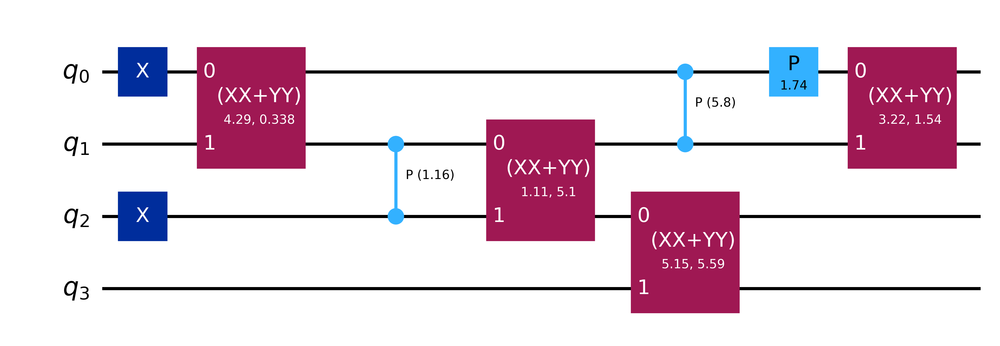

# ExtraFerm

```bash
pip install extraferm
```

## Overview

This library can be used to estimate Born rule probabilities of measurement outcomes from particle-number conserving extended matchgate circuits:

- **Extended matchgate**: the universal gate set consisting of matchgates + controlled‑phase gates  
- **Particle-number conserving**: the Hamming weight of initial state is preserved at all points by the circuit

## Circuit Extent

Our simulator runs most efficiently when the circuit’s **extent** is close to one. The extent is defined as:

$$
\xi^* = \prod_{j=1}^k \bigl(\cos(\theta_j/4) + \sin(\theta_j/4)\bigr)^2
$$

where $\theta_j$ is the angle of the $j$-th controlled-phase gate.

## Use

Users should interact with the simulator through the [`outcome_probabilities`](python/extended_matchgate_simulator/interface.py) function in `interface.py`. 

## Example

```python
import numpy as np
from qiskit import QuantumCircuit
from qiskit.circuit.library import XXPlusYYGate

from extraferm import outcome_probabilities

# Create a small circuit
seed = 123
rng = np.random.default_rng(seed=seed)
angles = rng.uniform(0, 2 * np.pi, size=12)
qc = QuantumCircuit(4)
qc.x([0, 2])
qc.append(XXPlusYYGate(theta=angles[0], beta=angles[1]), [0, 1])
qc.cp(theta=angles[3], control_qubit=1, target_qubit=2)
qc.append(XXPlusYYGate(theta=angles[4], beta=angles[5]), [1, 2])
qc.cp(theta=angles[6], control_qubit=0, target_qubit=1)
qc.p(theta=angles[7], qubit=0)
qc.append(XXPlusYYGate(theta=angles[8], beta=angles[9]), [2, 3])
qc.append(XXPlusYYGate(theta=angles[10], beta=angles[11]), [0, 1])

# Estimate a few bitstring probabilitites
bitstrings = [0b0101, 0b1100, 0b0011]
probs = outcome_probabilities(
    circuit=qc, outcome_states=bitstrings, trajectory_count=100_000, seed=seed
)

# Show results
print(probs)
qc.draw("mpl", scale=0.8, fold=-1)
```

[5.09355260e-01 1.56195696e-33 8.07714813e-02]



